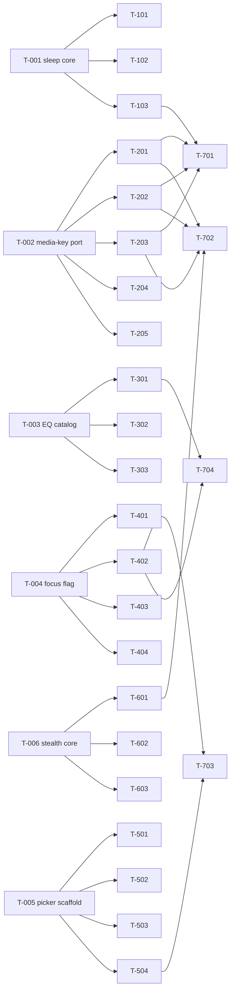

# Build Site: wrkmon-go v2.x

Dependency-tiered task graph covering all six v2.x feature kits (Sleep Timer, Media Keys, Equalizer, Focus Mode, Theme Picker, Stealth Mode) and their three explicit cross-domain coordination points.

---

## Tier 0 — No Dependencies (Start Here)

Domain-root foundations. Each establishes the core abstraction, state model, or config schema for its kit. All six can run in parallel.

| Task | Title | Cavekit | Requirement | Effort |
|------|-------|---------|-------------|--------|
| T-001 | Sleep timer core state machine (start/cancel/tick/elapse, session-scoped, single-active invariant) | sleep-timer | R1, R3, R5 | M |
| T-002 | Media-key port interface + diagnostic sink (play/pause/next/prev callbacks, metadata setter, availability log) | media-keys | R1, R3 | M |
| T-003 | EQ preset catalog + mpv `af` filter chain definitions (flat, bass-boost, vocal-boost, treble-boost, off) | equalizer | R1 | S |
| T-004 | Focus-mode layout state flag + view-tree gating in Bubble Tea model | focus-mode | R1, R2 | M |
| T-005 | Theme picker screen scaffold (Bubble Tea sub-model, list widget, navigation key bindings) | theme-picker | R2, R3 | M |
| T-006 | Stealth-mode state + terminal-title OSC 2 emitter (neutral string default "Terminal", empty-fallback) | stealth-mode | R2, R3 | M |

---

## Tier 1 — Depends on Tier 0

Adapters, slash-command wiring, persistence, and TUI integration layered onto each Tier-0 foundation.

| Task | Title | Cavekit | Requirement | blockedBy | Effort |
|------|-------|---------|-------------|-----------|--------|
| T-101 | `/sleep <mins>` slash command — parse positive int, reject non-positive/non-integer with visible message, confirmation with end time | sleep-timer | R1 | T-001 | S |
| T-102 | `/sleep` status + `/sleep cancel` subcommands — report remaining (minute precision) or "no timer", cancel with confirmation or "nothing to cancel" | sleep-timer | R2, R3 | T-001 | S |
| T-103 | Sleep-elapse hook — call player.Stop, disable auto-advance for this elapse, emit visible toast, clear timer so status reports none | sleep-timer | R4 | T-001 | M |
| T-201 | Linux MPRIS adapter (godbus/dbus + org.mpris.MediaPlayer2) — register player, wire Play/Pause/Next/Previous, expose title/artist, clear on stop | media-keys | R2, R1, R5 | T-002 | L |
| T-202 | macOS media-remote adapter (MPNowPlayingInfoCenter + MPRemoteCommandCenter via cgo) — transport + metadata | media-keys | R2, R1, R5 | T-002 | L |
| T-203 | Windows SystemMediaTransportControls adapter (WinRT via go-ole or cgo bridge) — transport + metadata | media-keys | R2, R1, R5 | T-002 | L |
| T-204 | Config flag `media_keys.enabled` (default true, persisted in TOML) + startup gate that skips all adapter registration when disabled | media-keys | R4 | T-002 | S |
| T-205 | Graceful-degradation wrapper — catch adapter registration errors, log to diagnostic sink, no stderr/dialog, confirm non-media controls unaffected | media-keys | R3 | T-002 | S |
| T-301 | `/eq` slash command — no-arg reports current, name activates preset (with confirmation), `off` disables, unknown rejected with visible message | equalizer | R2, R3 | T-003 | S |
| T-302 | mpv IPC live filter apply — send `af set` or `af clear` on selection, no track restart, applies to next track when idle, back-to-back switching | equalizer | R4 | T-003 | M |
| T-303 | EQ preset persistence (TOML `equalizer.preset`) — load on startup, save on change, "off" round-trips, restored preset applies on first play | equalizer | R5 | T-003 | S |
| T-401 | `/focus` slash command — toggle enter/exit, available from both layouts, reuse Tier-0 layout flag | focus-mode | R1 | T-004 | S |
| T-402 | Focus minimal view — hide queue/history/log panels, show now-playing title + progress bar, keep status bar visible | focus-mode | R2 | T-004 | M |
| T-403 | State-preservation guarantee — entering/exiting focus does not mutate queue contents, history contents, list selection, playback position, volume, or play/pause state | focus-mode | R4 | T-004 | S |
| T-404 | Keyboard shortcut routing in focus — play/pause, seek ±, volume ±, next/prev all dispatch identically to default layout | focus-mode | R3 | T-004 | S |
| T-501 | `/theme` dispatcher — no-arg opens picker, name-arg preserves direct-set behavior, unknown name rejected with visible message (picker not opened) | theme-picker | R1 | T-005 | S |
| T-502 | Picker list population — enumerate every name-settable theme, mark active theme on open, stable deterministic order (sorted by id) | theme-picker | R2 | T-005 | S |
| T-503 | Live preview engine — re-render picker surfaces (bg/text/accent) within one frame on highlight change, changes not persisted until commit | theme-picker | R4 | T-005 | M |
| T-504 | Commit (Enter) / cancel (Esc) — commit applies theme globally and writes TOML (survives restart); cancel restores prior theme and writes nothing | theme-picker | R5 | T-005 | M |
| T-601 | `/stealth` slash command — toggle on/off, report resulting state in confirmation message | stealth-mode | R1 | T-006 | S |
| T-602 | Track-title override suppression — when stealth on, app does not emit track-name OSC 2 updates on track change; when off, resume normal behavior | stealth-mode | R2 | T-006 | S |
| T-603 | Stealth persistence (TOML `stealth.enabled`, `stealth.neutral_title`) — state and configured string survive restart, re-applied on startup | stealth-mode | R4 | T-006 | S |

---

## Tier 2 — Coordination & Cross-Domain Integration

Explicit coordination tasks covering the three interaction pairs called out in the overview, plus final cross-domain integration verification.

| Task | Title | Cavekit | Requirement | blockedBy | Effort |
|------|-------|---------|-------------|-----------|--------|
| T-701 | Sleep × Media-Keys coordination — after elapse, media-key play resumes current track from halted position and does not re-arm the timer | sleep-timer, media-keys | sleep-timer/R4 | T-103, T-201, T-202, T-203 | M |
| T-702 | Stealth × Media-Keys coordination — when stealth on, OS media integration metadata slots cleared/unset for title+artist; transport (R1) still works even if metadata suppression fails | stealth-mode, media-keys | stealth-mode/R5, media-keys/R5 | T-601, T-201, T-202, T-203 | M |
| T-703 | Theme × Focus coordination — committed theme applies identically in default and focus layouts; live preview also covers focus surfaces if focus is active when picker opens | theme-picker, focus-mode | theme-picker/R5, focus-mode/R2 | T-402, T-504 | S |
| T-704 | Focus × Equalizer availability — `/eq` command fully usable while focus mode active (parsing, confirmation toast, preset switching, persistence) | focus-mode, equalizer | focus-mode/R3, equalizer/R3 | T-301, T-402 | S |

---

## Summary Table

| Tier | Tasks | Effort S | Effort M | Effort L |
|------|-------|----------|----------|----------|
| 0 | 6 | 1 | 5 | 0 |
| 1 | 22 | 13 | 6 | 3 |
| 2 | 4 | 2 | 2 | 0 |
| **Total** | **32** | **16** | **13** | **3** |

Tasks per domain: Sleep Timer 4, Media Keys 6, Equalizer 4, Focus Mode 5, Theme Picker 5, Stealth Mode 4, Coordination 4.

---

## Coverage Matrix

Every acceptance criterion from every kit maps to at least one T-NNN task. **100% COVERED.**

### Sleep Timer (cavekit-sleep-timer.md)

| Req | Acceptance Criterion (abbrev.) | Task(s) |
|-----|-------------------------------|---------|
| R1 | Positive int arg starts timer for N mins | T-101 |
| R1 | Only one timer active; new replaces old | T-001, T-101 |
| R1 | Non-positive / non-int rejected with visible msg, no start | T-101 |
| R1 | Visible confirmation with end time or remaining | T-101 |
| R2 | Status while active reports remaining (min precision) | T-102 |
| R2 | Status when inactive reports "no timer" | T-102 |
| R2 | Remaining decreases monotonically as real time passes | T-001, T-102 |
| R3 | Cancel active stops timer + visible confirmation | T-102 |
| R3 | Cancel when none: visible "nothing to cancel", no error | T-102 |
| R3 | Starting while running replaces previous, discards prior end | T-001, T-101 |
| R4 | On elapse, current track stops producing audio | T-103 |
| R4 | On elapse, visible indication timer fired | T-103 |
| R4 | On elapse, no further queued tracks auto-play | T-103 |
| R4 | After elapse, timer inactive; status reports none | T-103 |
| R4 | After elapse, subsequent play from any source resumes, does not re-arm | T-103, T-701 |
| R5 | Active timer persists across track changes in session | T-001 |
| R5 | Timer not restored after app restart | T-001 |
| R5 | No timer state written to durable config | T-001 |

### Media Keys (cavekit-media-keys.md)

| Req | Acceptance Criterion (abbrev.) | Task(s) |
|-----|-------------------------------|---------|
| R1 | Play/pause key toggles playing/paused | T-201, T-202, T-203 |
| R1 | Next key advances to next queued track | T-201, T-202, T-203 |
| R1 | Previous key returns to prior (history) | T-201, T-202, T-203 |
| R1 | Actions work without terminal focus | T-201, T-202, T-203 |
| R2 | Linux uses desktop-standard (MPRIS) | T-201 |
| R2 | macOS uses system media-remote | T-202 |
| R2 | Windows uses OS global media hotkeys (SMTC) | T-203 |
| R3 | Registration failure: app starts/runs without crash | T-205 |
| R3 | No user-visible error dialog / blocking msg on startup | T-205 |
| R3 | Non-media-key controls still work | T-205 |
| R3 | Unavailability record retrievable for diagnostics | T-002, T-205 |
| R4 | No config changes: integration attempted on first launch | T-204 |
| R4 | Config flag disables registration for session | T-204 |
| R4 | Disabled setting persists across restarts | T-204 |
| R5 | Track title exposed when supported + active | T-201, T-202, T-203 |
| R5 | Artist/uploader exposed when supported + known | T-201, T-202, T-203 |
| R5 | No stale track metadata when no track active | T-201, T-202, T-203 |
| R5 | Metadata failure does not prevent R1 transport | T-702 |

### Equalizer (cavekit-equalizer.md)

| Req | Acceptance Criterion (abbrev.) | Task(s) |
|-----|-------------------------------|---------|
| R1 | Presets exactly: flat, bass-boost, vocal-boost, treble-boost | T-003 |
| R1 | Each preset has distinct deterministic shaping effect | T-003 |
| R1 | "off" disabled state selectable alongside presets | T-003 |
| R2 | No-arg reports current preset or "off" | T-301 |
| R2 | Reported value matches last selection or persisted | T-301, T-303 |
| R3 | Valid name activates preset + confirmation | T-301 |
| R3 | "off" disables + confirmation | T-301 |
| R3 | Unknown name rejected, preset unchanged | T-301 |
| R4 | Mid-playback select changes tone without stop/restart | T-302 |
| R4 | Selection while idle applies to next track played | T-302 |
| R4 | Back-to-back switching: only latest active | T-302 |
| R5 | Selected preset active on startup after restart | T-303 |
| R5 | "off" persists across restart | T-303 |
| R5 | Persisted value stored in user config | T-303 |

### Focus Mode (cavekit-focus-mode.md)

| Req | Acceptance Criterion (abbrev.) | Task(s) |
|-----|-------------------------------|---------|
| R1 | Invoking outside focus enters focus mode | T-401 |
| R1 | Invoking inside focus exits to default layout | T-401 |
| R1 | Command available from both layouts | T-401 |
| R2 | Queue panel not visible in focus | T-402 |
| R2 | History panel not visible in focus | T-402 |
| R2 | Log/debug panel not visible in focus | T-402 |
| R2 | Now-playing title + progress visible in focus | T-402 |
| R2 | Status bar remains visible in focus | T-402 |
| R3 | Play/pause shortcut works in focus | T-404 |
| R3 | Seek fwd/back shortcuts work in focus | T-404 |
| R3 | Volume up/down shortcuts work in focus | T-404 |
| R3 | Next/prev-track shortcuts work in focus | T-404, T-704 |
| R4 | Queue panel contents preserved on exit | T-403 |
| R4 | History panel contents preserved on exit | T-403 |
| R4 | Selected list item preserved on exit | T-403 |
| R4 | Playback position, volume, play/pause unaffected | T-403 |

### Theme Picker (cavekit-theme-picker.md)

| Req | Acceptance Criterion (abbrev.) | Task(s) |
|-----|-------------------------------|---------|
| R1 | No-arg opens picker as screen/overlay | T-501 |
| R1 | Name-arg bypasses picker, preserves direct-set | T-501 |
| R1 | Unknown name rejected, picker not opened | T-501 |
| R2 | Every name-settable theme listed in picker | T-502 |
| R2 | Currently active theme marked on open | T-502 |
| R2 | List in stable deterministic order | T-502 |
| R3 | Up arrow moves selection up (deterministic boundary) | T-005, T-503 |
| R3 | Down arrow moves selection down (deterministic boundary) | T-005, T-503 |
| R3 | Enter commits highlighted theme | T-504 |
| R3 | Esc cancels picker | T-504 |
| R4 | Highlight change updates UI within one frame | T-503 |
| R4 | Preview covers main surfaces (bg/text/accent) | T-503, T-703 |
| R4 | Preview not persisted until commit | T-503 |
| R5 | Commit applies theme to entire TUI | T-504, T-703 |
| R5 | Commit writes to user config, survives restart | T-504 |
| R5 | Cancel restores pre-picker theme | T-504 |
| R5 | Cancel does not write to config | T-504 |

### Stealth Mode (cavekit-stealth-mode.md)

| Req | Acceptance Criterion (abbrev.) | Task(s) |
|-----|-------------------------------|---------|
| R1 | Slash command while off turns on + confirmation | T-601 |
| R1 | Slash command while on turns off + confirmation | T-601 |
| R1 | Command reports resulting state | T-601 |
| R2 | When on: terminal title = configured neutral string | T-006, T-602 |
| R2 | When off: app stops overriding, stealth title cleared | T-602 |
| R2 | Track-change title overrides suppressed while on | T-602 |
| R3 | Default neutral string is "Terminal" | T-006 |
| R3 | User-configurable neutral string persists across restarts | T-603 |
| R3 | Empty/whitespace value falls back to default, no error | T-006 |
| R4 | Stealth on at shutdown: on at next startup, title = neutral | T-603 |
| R4 | Stealth off at shutdown: off at next startup | T-603 |
| R4 | Stealth state stored in user config | T-603 |
| R5 | While on, no title/artist/uploader via OS media integration | T-702 |
| R5 | When disabled, normal metadata exposure resumes | T-702 |
| R5 | Suppression failure does not prevent R2 title override | T-702 |

**Coverage Totals:**
- Sleep Timer: 18 / 18 criteria COVERED (100%)
- Media Keys: 18 / 18 criteria COVERED (100%)
- Equalizer: 14 / 14 criteria COVERED (100%)
- Focus Mode: 16 / 16 criteria COVERED (100%)
- Theme Picker: 17 / 17 criteria COVERED (100%)
- Stealth Mode: 15 / 15 criteria COVERED (100%)
- **Overall: 98 / 98 criteria COVERED (100%)**

---

## Dependency Graph

Arrows point from dependency to dependent. Siblings at the same depth with no edges between them may execute in parallel. All six Tier-0 roots are independent and may be picked up simultaneously by separate agents.
